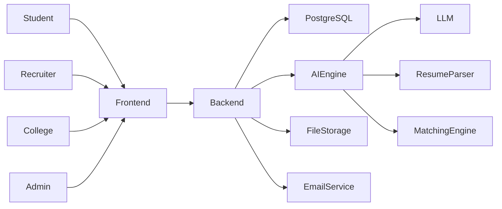
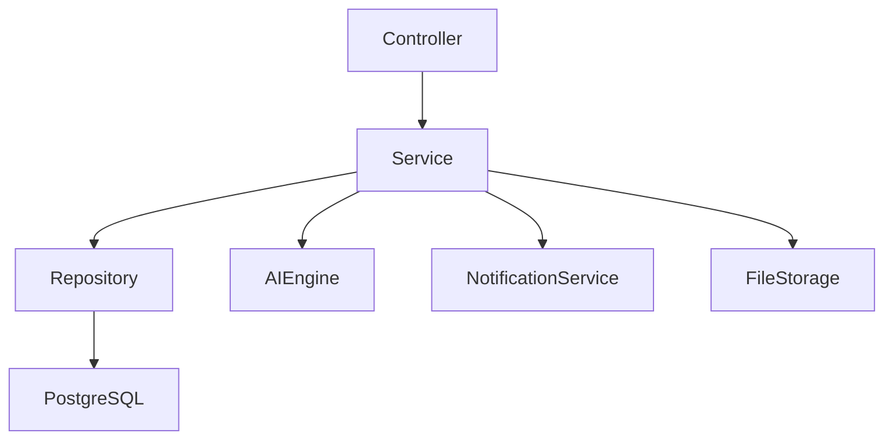
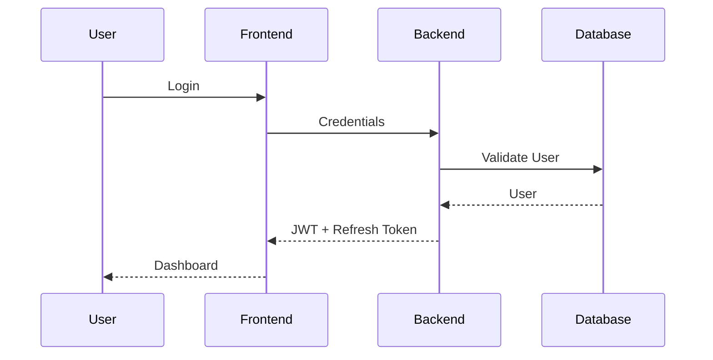

# NEXORA AI

# System Architecture

**Version:** 1.0  
**Status:** Approved

---

# Document Information

| Property | Value |
|----------|--------|
| Document Name | System Architecture |
| Project | NEXORA AI |
| Version | 1.0 |
| Owner | NEXORA Development Team |
| Status | Approved |
| Last Updated | July 2026 |

---

# 1. Purpose

This document defines the complete system architecture of the NEXORA AI platform.

It serves as the technical blueprint for all developers and stakeholders by describing how different modules interact, how data flows through the system, and how the platform is designed for scalability, security, and maintainability.

---

# 2. Architecture Goals

The architecture is designed to achieve the following goals:

- Scalability
- Security
- High Availability
- Maintainability
- Modularity
- Performance
- AI Integration
- Extensibility
- Clean Architecture
- API-First Development

---

# 3. Architecture Style

NEXORA AI follows a **Modular Monolith Architecture** for Version 1.

Reasons:

- Faster development
- Easier deployment
- Simpler debugging
- Lower infrastructure cost
- Easier testing
- Clear module boundaries

Future versions may evolve selected modules into microservices without major redesign.

---

# 4. High-Level Architecture



---

# 5. Technology Stack

## Frontend

- React
- TypeScript
- Vite
- Tailwind CSS
- React Router
- Axios
- TanStack Query
- Framer Motion

---

## Backend

- Java 21
- Spring Boot 3.x
- Spring Security
- Spring Data JPA
- Flyway
- Maven
- Lombok

---

## Database

- PostgreSQL

---

## AI Layer

- Resume Parser
- Skill Analyzer
- Resume Scoring Engine
- Candidate Matching Engine
- Career Recommendation Engine

---

## DevOps

- Docker
- GitHub
- GitHub Actions
- Nginx
- Linux Server

---

# 6. Core Modules

The system consists of the following major modules:

- Authentication
- Student Module
- Recruiter Module
- College Module
- Resume Module
- AI Engine
- Job Management
- Matching Engine
- Notification Service
- Dashboard
- Admin Panel

Each module has a clearly defined responsibility and communicates through internal service boundaries.

---

# 7. Backend Architecture



The Controller layer never communicates directly with the database.

---

# 8. Frontend Architecture

```mermaid
flowchart TD

Pages

↓

Components

↓

Hooks

↓

Services

↓

API Client

↓

Backend
```

Responsibilities:

- Pages manage screens.
- Components provide reusable UI.
- Hooks manage business logic.
- Services call backend APIs.
- API Client handles HTTP requests.

---

# 9. Authentication Flow



---

# 10. Data Flow

```mermaid
flowchart LR

Student

↓

Resume Upload

↓

Resume Parser

↓

Skill Extraction

↓

Resume Score

↓

Matching Engine

↓

Job Recommendation

↓

Recruiter Dashboard
```

---

# 11. AI Architecture

The AI Engine contains independent services:

- Resume Parsing
- Resume Scoring
- Skill Extraction
- Candidate Ranking
- Job Matching
- Career Recommendation

Each AI service receives structured input from the backend and returns processed insights.

---

# 12. Database Layer

Primary database:

- PostgreSQL

Persistence:

- Spring Data JPA
- Hibernate

Migration:

- Flyway

Connection Pool:

- HikariCP

---

# 13. External Integrations

The platform may integrate with:

- GitHub
- LinkedIn
- Email Service
- Cloud File Storage
- Coding Platforms
- Calendar Services

All integrations must be isolated behind service interfaces.

---

# 14. Security Architecture

Security layers include:

- Spring Security
- JWT Authentication
- Role-Based Access Control
- Password Encryption
- HTTPS
- Input Validation
- Rate Limiting
- Audit Logging

---

# 15. Scalability Strategy

The platform is designed to scale horizontally.

Future improvements may include:

- Redis
- Message Queue
- CDN
- Microservices
- Kubernetes
- Distributed Caching

---

# 16. Deployment Overview

```mermaid
flowchart LR

Browser

↓

React Frontend

↓

Spring Boot API

↓

PostgreSQL

Spring Boot API --> Email Service

Spring Boot API --> AI Engine

Spring Boot API --> File Storage
```

---

# 17. Logging Strategy

Application logging should include:

- API Requests
- Authentication Events
- Errors
- AI Processing
- Database Exceptions
- Audit Logs

SLF4J should be used across all modules.

---

# 18. Monitoring

The platform should support:

- Spring Boot Actuator
- Health Checks
- Performance Metrics
- Error Tracking
- Uptime Monitoring

---

# 19. Architecture Principles

Every module should follow:

- SOLID Principles
- Clean Architecture
- Separation of Concerns
- Dependency Injection
- Reusable Components
- API-First Design

---

# 20. Future Evolution

Future architecture enhancements may include:

- Event-Driven Architecture
- AI Microservices
- Real-Time Notifications
- Mobile Backend
- Multi-Tenant Support
- Multi-Region Deployment

---

# 21. Conclusion

The architecture presented in this document provides a scalable, secure, and maintainable foundation for the NEXORA AI platform.

All future modules should align with the architectural principles and design decisions documented here.

---

# Next Document

After completing the System Architecture, continue with:

**03_DOCUMENTATION_STANDARD.md**

This document defines the structure, formatting, and documentation rules that every future Markdown file must follow.
